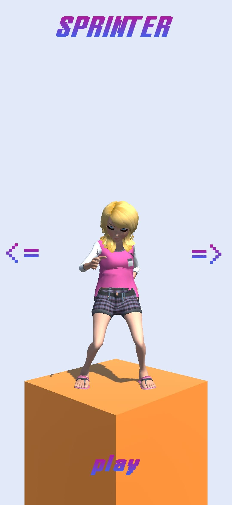
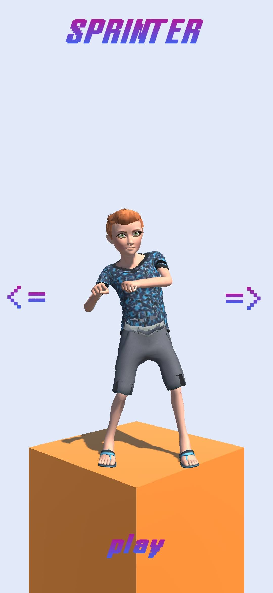
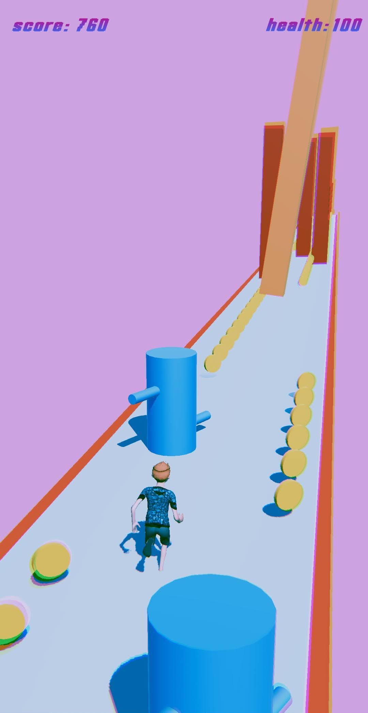
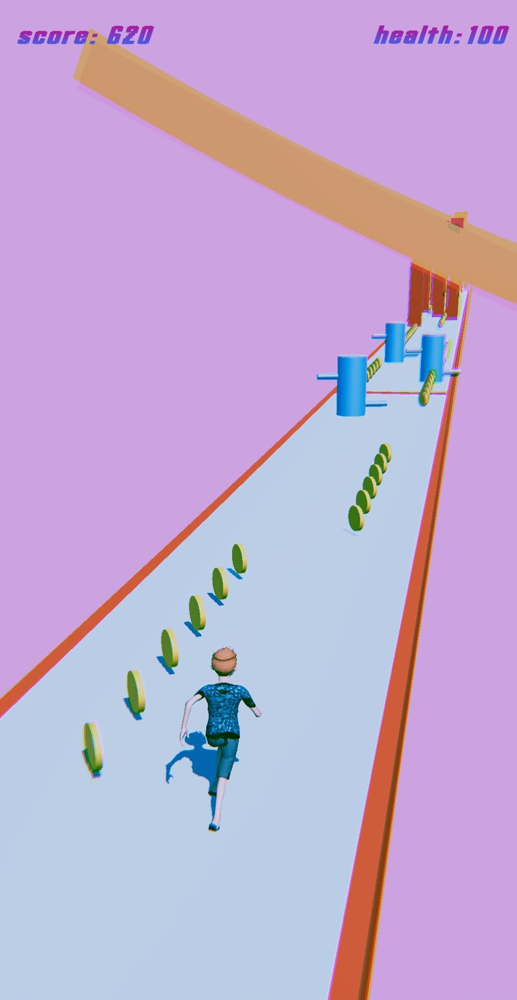
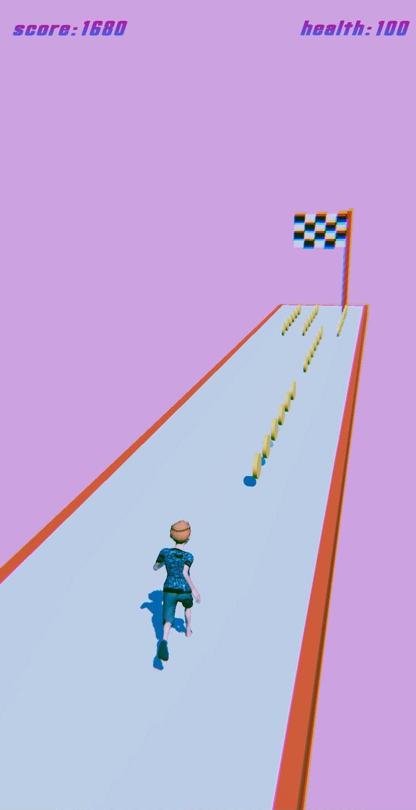
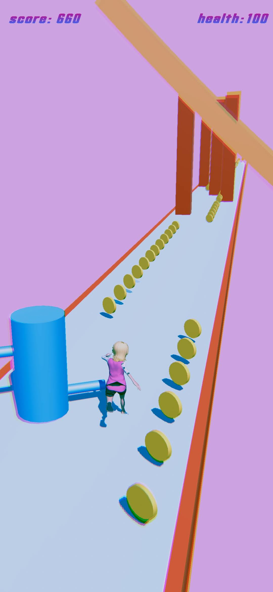
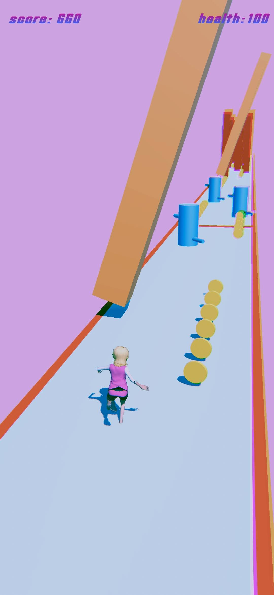
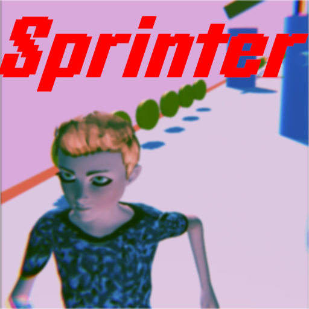
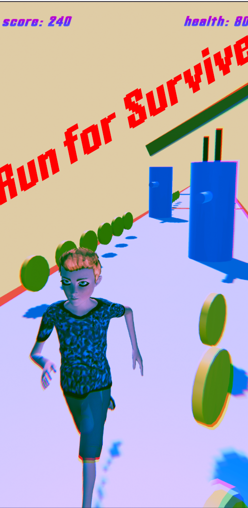
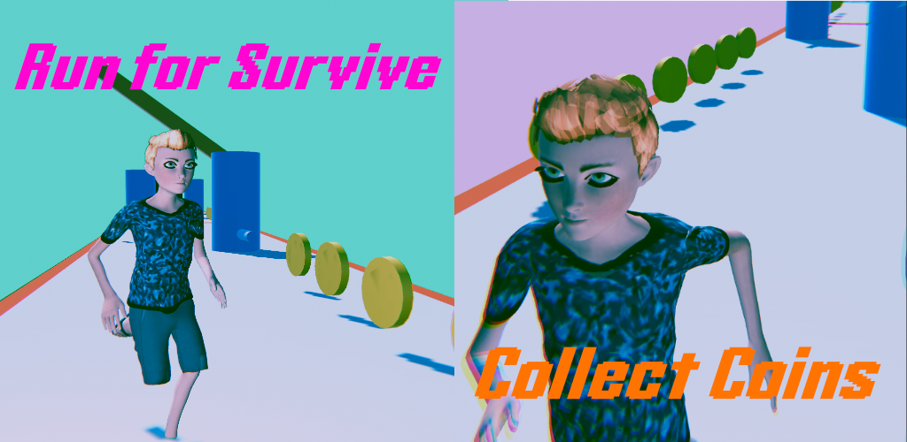

---
title: "Sprinter Game"
author: [Mehmet Semih Celek]
date: "2022-01-15"
subject: "Final Report"
keywords: ["Game Development", "Mobile Game"]
subtitle: "Mobile Game"
lang: "en"
titlepage: true
toc-own-page: true
titlepage-rule-color: "360049"
titlepage-rule-height: 0
titlepage-background: "background1.pdf"
page-background: "background5.pdf" 
logo: "images/icon.png"
logo-width: 40mm
...

# Game Design Document

## Sprinter

### [Project Repository Link](https://github.com/semihcelek/sprite)

### Runner Game

**A Runner Game that focuses on character advancement and character and environment improvements**

It's a runner game that focuses improving character and changing game environment. It will be a hyper casual game that aims to satisfy player by playing it. The Game will have satisfying and connecting effect on player. The game will be monitored with ads and in-app purchase for character appearance. Game is going to have very simple environment and player will run on levels. On running platform player will be challenged with obstacles.

### Game Mechanics
1. Player will gonna touch the screen and swipes his/her finger all the time unless tap mechanics.

2. When player fails, player will scratch the cards to regain the chance to start again.

3. Instead of the direct face like runner games(90degree), game is going to be(84degree).

4. Basic idle mechanics are added for upgrading the character in the game.

5. On the running platform player will be challenged with obstacles.

6. Player will have health and it will decrease when crashes the obstacles.

7. On the platform coins are placed and player can collected it.

### Story

#### Character

In the game we have character that tries to reach to the final object flag. Game will focus this very basic story.

#### Setting 

Game have colourful environment that will change through phases. and primitive objects going to be used keep minimalist look on the game and player always will be challenged to both escape from obstacles and collect the coins.

#### Target Audience

Target Audience of game is everyone that enjoys mobile games. 

#### Levels

Levels in the game includes obstacles for player to escape and make the game more intimidating and entertaining. 

#### User Interface

Game will have main Ui that represents current state of character and will have menus enables player to improve their character. In playing phase score and health will be displayed.

#### Assets 

Most of the assets in the game are primitive objects like cubes, rectangles, and cylinders. Also, assets for players are taken from Adobe Mixamo which is free service both player models and animations. Characters have 4 main animations, Idle, Running, Jump, Fall.

#### Technical
Unity 3D will be Game Engine, and Blender will be main source of 3D objects.

## Screen Shots

{width=40%}
{width=40%}

{width=30%}
{width=30%}
{width=30%}

{width=30%}
{width=30%}

# Development Cycle

Game is built with Unity 3d game engine. In development C# language is used. Game is developed around 6 or 7 weeks and the code base is stored on GitHub. I learned Unity throughout developing this game, so it was very informative for me.

# Store Publish

## Google Play Store

### [Store Link](https://play.google.com/store/apps/details?id=com.SemihCelek.Sprinter)

Game is currently listed on Google Play Store and can be accessed with the link.

## Store Images

{width=30%}

{width=40%}

{width=60%}

## Privacy Policy

### Creating Privacy Policy Site

[Web Site Link](https://semihcelek.github.io/blog/sprinter-privacy-policy)

In order to publish the game on Google Play Store, having a privacy policy site is essential. It not only specify our intentions on data usage but also informs Play Store.

## **Privacy Policy**

Semih Celek built the Sprinter app as a Free app. This SERVICE is provided by Semih Celek at no cost and is intended for use as is.

This page is used to inform visitors regarding my policies with the collection, use, and disclosure of Personal Information if anyone decided to use my Service.

If you choose to use my Service, then you agree to the collection and use of information in relation to this policy. The Personal Information that I collect is used for providing and improving the Service. I will not use or share your information with anyone except as described in this Privacy Policy.

The terms used in this Privacy Policy have the same meanings as in our Terms and Conditions, which are accessible at Sprinter unless otherwise defined in this Privacy Policy.

**Information Collection and Use**

For a better experience, while using our Service, I may require you to provide us with certain personally identifiable information. The information that I request will be retained on your device and is not collected by me in any way.

The app does use third-party services that may collect information used to identify you.

Link to the privacy policy of third-party service providers used by the app

- [Google Play Services](https://www.google.com/policies/privacy/)
- [AdMob](https://support.google.com/admob/answer/6128543?hl=en)
- [Unity](https://unity3d.com/legal/privacy-policy)

**Log Data**

I want to inform you that whenever you use my Service, in a case of an error in the app I collect data and information (through third-party products) on your phone called Log Data. This Log Data may include information such as your device Internet Protocol (“IP”) address, device name, operating system version, the configuration of the app when utilizing my Service, the time and date of your use of the Service, and other statistics.

**Cookies**

Cookies are files with a small amount of data that are commonly used as anonymous unique identifiers. These are sent to your browser from the websites that you visit and are stored on your device's internal memory.

This Service does not use these “cookies” explicitly. However, the app may use third-party code and libraries that use “cookies” to collect information and improve their services. You have the option to either accept or refuse these cookies and know when a cookie is being sent to your device. If you choose to refuse our cookies, you may not be able to use some portions of this Service.

**Service Providers**

I may employ third-party companies and individuals due to the following reasons:

- To facilitate our Service;
- To provide the Service on our behalf;
- To perform Service-related services; or
- To assist us in analyzing how our Service is used.

I want to inform users of this Service that these third parties have access to their Personal Information. The reason is to perform the tasks assigned to them on our behalf. However, they are obligated not to disclose or use the information for any other purpose.

**Security**

I value your trust in providing us your Personal Information, thus we are striving to use commercially acceptable means of protecting it. But remember that no method of transmission over the internet, or method of electronic storage is 100% secure and reliable, and I cannot guarantee its absolute security.

**Links to Other Sites**

This Service may contain links to other sites. If you click on a third-party link, you will be directed to that site. Note that these external sites are not operated by me. Therefore, I strongly advise you to review the Privacy Policy of these websites. I have no control over and assume no responsibility for the content, privacy policies, or practices of any third-party sites or services.

**Children’s Privacy**

These Services do not address anyone under the age of 13. I do not knowingly collect personally identifiable information from children under 13 years of age. In the case I discover that a child under 13 has provided me with personal information, I immediately delete this from our servers. If you are a parent or guardian and you are aware that your child has provided us with personal information, please contact me so that I will be able to do the necessary actions.

**Changes to This Privacy Policy**

I may update our Privacy Policy from time to time. Thus, you are advised to review this page periodically for any changes. I will notify you of any changes by posting the new Privacy Policy on this page.

This policy is effective as of 2021-12-20

**Contact Us**

If you have any questions or suggestions about my Privacy Policy, do not hesitate to contact me at semihcelek0@hotmail.com.

# App Store Optimizations

Publishing the game on stores was the important aspect of developing a game. Optimizing and properly presenting the game was the vital part of the game development. Each application stores have their own characteristic and requires own AppStore Optimization. . 

## ASO for Sprinter Game

App Store Optimization played huge role on the success of publishing the game. It is almost mandatory to have proper App Store Optimization when listing game on store. Creating a unique impression in app stores played important role for audience for getting downloads. 

# Performance Datas

Performance datas for sprinter game unfortunately left limited. Due to the lack of data it wasn't healthy to make predictions.

\pagebreak

# Conclusion & Final Words

In conclusion making a successful game has lot of steps and requirements. At first glance, it might be seem that developing a game was the most important aspect of the game development, but in reality it's much as important to have good publishing and marketing phase as having a good development phase. This project made me realize that, in order to have successful product, it's highly important to make plan for the project. It's valuable to create game design document and simple prototype for starter. Creating game design document allows us to understand the purpose and the boundaries of our game. Creating prototype game with primitive design approach allows us to whether our game is fun/enjoyable or not. Prototyping games are really important stage in game development because it helps us the decide whether we continue idea/design or not. It's also really fast and cost efficient approach in game development, it's easy to get things working and testing the game design that we try to create. 

When we try to create a game design, it's very easy to fall an idea that works in the game design but doesn't work when game is implemented. In order to prevent this happening, creating simple prototype is valid solution. In Sprinter game, I tried to implement basic game mechanics to test the gameplay. Prototype of the game was nothing more than a simple capsule and rectangle platform and positioning the camera. This approach immediately indicated that the game play that we desired in game design document was working. After that I stared work more. I got models and animations and implemented even more.

Making a game is one thing but publishing and marketing is another. After game is ready for the store publishing it was necessary to create store presentation for caching the intention of the audience. It's highly important to create interesting artwork, story, in-game scenes and setting proper key words and genre for the game. Creating an interesting and unique first impression of the game on the store listing is one of the important aspect which determines the succession of App Store Optimizations. 

With the help of the performance data, we keep improve our both game and app store listing presentations. Keeping track of the data enables us to compare our improvements whether they are working or not. And we decide next actions based on the solid data and statistics.

On the other hand monetization system in games enables us to make profit from game. In the mobile games we can make money with showing ads to our audience or encourage user to in-app purchases, also we can make our games paid application. In sprinter game monetization is implemented with ads. It's highly important to place ads in the game because if its too much, players will immediately leave the game, or if its too less, we cannot profit effectively. One of the way to balance for ads to give player choice to watch ads. For example, when the player dies in the game, offering a video add for restoring the game is valid implementation of showing ads. Players will likely to watch ads for regaining their position in the game. In this way we can profit efficiently and keep audience interested.

Lastly, making this game made me more interested in game development and understating the whole game development process really help me to grasp the fundamentals. Developing a game is not only coding for creating the game, it's more like a producing whole product and marketing it. There is much more than just creating the game. I will continue to game development but I probably will continue other projects to explore other types of game designs and mechanics.
